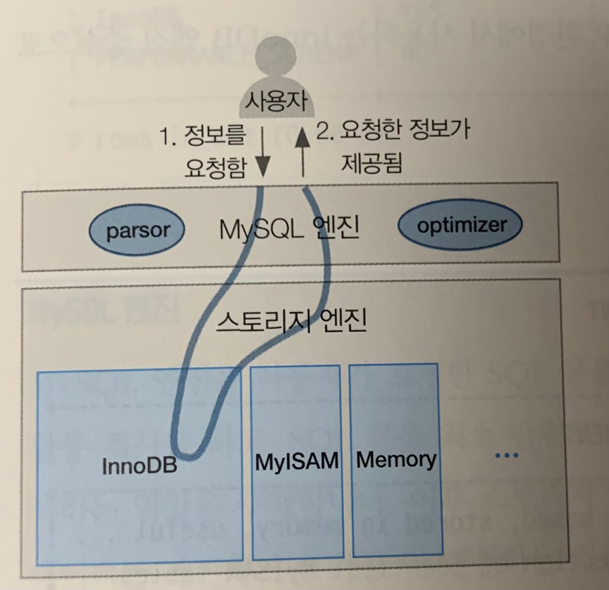
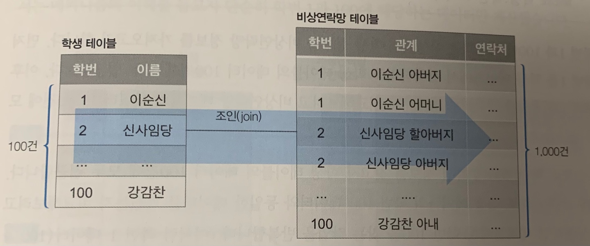

# SQL 튜닝 용어를 직관적으로 이해하기

## 물리 엔진과 오브젝트 용어

MySQL의 SQL 수행 프로세스
1. SQL문 실행
2. MySQL 엔진에서 문법 에러가 있는지, DB에 테이블이 존재하는지 등을 검사함(파싱 작업을 하는 파서 parser 역할)
3. 요청한 데이터를 빠르고 효율적으로 찾아가는 전략적 계획 수립(옵티마이저 optimizer 역할)
4. 스토리지 엔진에 위치한 데이터까지 찾아간 뒤 해당 데이터를 MySQL 엔진으로 전달함
5. MySQL 엔진은 전달된 데이터에서 불필요한 부분을 필터링하고 필요한 연산을 수행한 뒤 사용자에게 최종 결과를 알려줌

### 스토리지 엔진
- SQL문을 토대로 DB에 저장된 디스크나 메모리에서 필요한 데이터를 가져온 후 데이터를 MySQL 엔진으로 보냄
- InnoDB: OTLP online transaction processing를 위해 사용
- MyISAM: 대량의 쓰기 트랜잭션 발생시 사용
- Memory: 메모리 데이터를 로드하여 빠르게 일긱위해 사용

### MySQL 엔진
- 스토리지 엔진에 가기 전
    - SQL 문법 검사와 적절한 오브젝트 활용 검사
    - SQL 문을 최소 단위로 분리하여 원하는 데이터를 빠르게 찾는 경로를 모색하는 역할 수행
- 스토리지 엔진에서 데이터를 받은 후
    - 불필요한 데이터 제거, 가공 및 연산

### SQL 프로세스 용어
- 파서
    - SQL을 최소 단위로 구성요소를 분리하고 트리로 만듬
    - 트리를 만드는 과정에서 문법 오류를 검사하며 오류 발생시 실행이 종료됨
- 전처리기
    - 생성된 트리 결과를 토대로 테이블, 뷰 등이 존재하는지 권한이 있는지 등을 검사함
- 옵티마이저
    - 데이터를 효율적으로 가져오기 위해 시간은 적게 비용 효율적인 경로로 데이터를 검색하는 방법에 관해 실행 계획을 수립함
- 엔진 실행기
    - 실행 계획을 토대로 스토리지 엔진을 호출해 필요한 데이터를 가져온 후 스토리지 엔진을 통해서 가져온 데이터 중 불필요한 데이터를 필터링하여 사용자가 원하는 결과를 전달함

### DB 오브젝트 용어
- 테이블
    - 데이터를 저장하는 오브젝트로 행과 열의 정보를 담음
- 로우(행)
    - 하나의 데이터 항목 집합이며 모든 행의 집합을 테이블이라고 함
    - 행 수가 많아지면 데이터에 접근하는 과정에서 시간이 오래 소요됨 -> 파티셔닝 기법으로 SQL 문의 성능 향상을 검토함
- 컬럼(열)
    - 사전에 정의한 데이터 유형으로 데이터값을 저장함
- 기본 키
    - 기본 키(PK)는 특정 행을 대표하는 열을 가리키는 용어
    - 두개 이상 조합하여 사용 가능
    - 인덱스 역할도 수행함, 클러스터형 인덱스가 기본이며 이는 기본키의 구성 열 순서를 기준으로 물리적인 스토리지에 데이터가 쌓임
- 외래 키
    - 외래 키(FK)는 외부에 있는 테이블을 항상 참조하며 데이터 변경되면 함께 영향을 받는 관계를 설정하는 키
- 인덱스
    - 데이터베이스에서 키값으로 실제 데이터 위치를 식별하고 데이터 접근 속도를 높이고자 생성되는 키 기준으로 정렬된 오브젝트
    - 고유 인덱스
        - 인덱스를 구성하는 열들의 데이터가 유일함
        - 기본 키는 NULL을 입력할 수 없지만 고유 인덱스는 입력할 수 있음
    - 비고유 인덱스
        - 고유 인덱스에서 데이터의 유일한 속성만 제외한 키
        - 신규 데이터가 입력되어 인덱스 재정렬되더라도 인덱스 열의 중복 체크를 거치지 않고 단순 정렬 작업을 수행함
- 뷰
    - 가상 테이블
    - 실제 테이블에서 데이터가 변경되면 뷰 테이블에서도 바로 변경된 데이터를 조회 가능함
    - 뷰 테이블에서 데이터를 변경하면 실제 테이블의 해당 데이터도 즉시 변경됨

## 논리적인 SQL 개념 용어

### 서브쿼리 위치에 따른 SQL 용어
- SELECT 절: 스칼라 서브쿼리
- FROM 절: 인라인 뷰
    - 내부에서 일시적으로 뷰를 생성하는 방식
    - 결과를 내부적으로 메모리 또는 디스크 임시 테이블을 생성하여 활용함
- WHERE 절: 중첩 서브쿼리

### 메인쿼리와의 관계성에 따른 SQL 용어
- 비상관 서브쿼리
    - SELECT * FROM 학생 WHERE XXX IN (SELECT XXX FROM 지도교수)
    - 메인쿼리와 서브쿼리 간에 관계성이 없음
    - 서브쿼리가 먼저 실행된 뒤에 메인 쿼리가 실행됨
    - DB 버전 및 옵티마이저에 따라 서브쿼리가 제거되고 하나의 메인쿼리로 통합되는 뷰 병합, 즉 SQL 재작성이 작동할 수 있음
- 상관 서브쿼리
    - SELECT * FROM 학생 WHERE XXX IN (SELECT XXX FROM 지도교수 WHERE 학생.학번 = YYY)
    - 메인쿼리와 서브쿼리 간에 관계성이 있음
    - 서브쿼리가 수행될려먼 메인쿼리의 값이 필요함
    - 메인쿼리 실행후 서브쿼리 실행후 다시 메인쿼리가 실행된 뒤 결과가 출력됨
    - DB 버전 및 옵티마이저에 따라 서브쿼리가 제거되고 하나의 메인쿼리로 통합되는 뷰 병합, 즉 SQL 재작성이 작동할 수 있음

### 반환 결과에 따른 SQL 용어
- 단일행 서브쿼리
    - 서브쿼리 결과가 1건의 행으로 반환됨
    - SELECT 절의 스칼라 서브쿼리와 동일함
- 다중행 서브쿼리
    - 서브쿼리 결과가 여러 건의 행으로 반횐됨
- 다중열 서브쿼리
    - 서브쿼리 결과가 여러 개의 열과 행으로 반환됨

### 조인 연산방식 용어
- 내부 조인 inner join
- 왼쪽 외부 조인 left outer join
    - 사람의 인지적 특성상 왼쪽 -> 오른쪽을 정방향으로 인식하므로 주로 사용함
- 오른쪽 외부 조인 right outer join
- 전체 외부 조인 full outer join
- 교차 조인 cross join
    - 데카르트 곱이라는 곱집합의 개념으로 조인한 테이블에서 발생할 수 잇는 모든 조합을 찾아내어 반환함
    - 잘못사용하면 많은 데이터를 조회하게 되므로 주의해야 됨
- 자연 조인 natural join
    - 2개 테이블에 동일한 열명이 있을 떄 조인 조건절을 따로 작성하지 않아도 자동으로 조인을 수행해주는 방식
    - 동일한 열명이 없으면 교차조인으로 수행됨

### 조인 알고리즘 용어
- 드라이빙 테이블(학생)과 드리븐 테이블(비상연락망)
    - 테이블에 접근하는 선후 관계에 따라 구분함
    - 가능한 적은 결과가 예상되는 테이블을 드라이빙 테이블로 선정하고 조인 조건절의 열이 인덱스로 설정되도록 구성해야 함

- 중첩 루프 조인
    - nested loop join(NL 조인)
    - 드라이빙 테이블의 데이터 1건당 드리븐 테이블을 반족해 검색하며 최종적으로 양쪽 테이블에 공통된 데이터를 출력함
    - 기본 키와 인덱스가 없는 두 테이블을 중첩 루프 조인하게 되면 두개의 모든 테이블을 조회하는 대참사가 벌어짐
    - 비고유 인덱스일 경우 임의 접근 방식인 렌덤 액세스가 발생하므로 데이터 액세스 번위를 좁히는 방향으로 인덱스를 설계하여 조건절을 작성해야 함
- 블록 중첩 루프 조인
    - block nested loop join(BNL 조인)
    - 중첩 루프 조인의 효율성을 높이고자 탄생함
    - 드라이빙 테이블에 조인 버퍼라는 개념을 도입하여 조인 성능을 향상시킴
    - 블록 해시 조인이라는 유사한 방식이 있음
- 배치 키 액세스 조인
    - batched key access join(BKA 조인)
    - 랜덤 엑세스의 단점을 해결하고자 접근할 데이터를 미리 예상하고 가져오는 방식
- 해시 조인
    - 중첩 루프 조인 방식에서 개선된 버전인 블록 중첩 루프 조인과 배치 키 액세스 조인의 한계를 탈피하는 조인
    - 내부적으로 생서된 해시값을 사용하여 조인함

## 개념적인 튜닝 용어

### 오브젝트 스캔 유형
- 테이블 스캔
    - 테이블 풀 스캔
        - 인덱스를 거치지 않고 처음부터 끝까지 데이터를 조회함
        - Where 절에 활용할 인덱스가 없음
        - 성능이 좋지 않음
- 인덱스 스캔
    - 인덱스 범위 스캔
        - 인덱스를 범위 기준으로 스캔한 뒤 스캔 결과를 토대로 데이터를 조회함
        - BETWEEN, <, >, LIKE 구문 등
        - 좁은 범위를 스캔할 때는 매우 효율적이지만 넓은 범위를 스캔할떄는 비효율적임
    - 인덱스 풀 스캔
        - 인덱스를 처음부터 끝까지 수행함
        - 인덱스 테이블만 조회하니 테이블 풀 스캔보다는 성능이 좋음
    - 인덱스 고유 스캔
        - 기본 키나 고유 인덱스로 테이블에 접근하는 장식
        - 인덱스를 사요하는 스캔 중 가장 효율적인 스캔 방법
        - Where 절에 = 조건으로 작성
        - 해당 조인 열이 키본키 또는 고유 인덱스의 선두 열로 설정되었을 때 활용
    - 인덱스 루스 스캔
        - 인덱스의 필요한 부분들만 골라 스캔하는 방식
        - Where 절 조건문 기준으로 필요한 데이터와 필요하지 않은 데이터를 구분한 뒤 불필요한 인덱스 키를 무시함
        - GROUP BY 구문이나 MAX(), MIN() 함수가 포함되면 작동함
    - 인덱스 병합 스캔
        - 테이블 내에 생성된 인덱스들을 통합해서 스캔하는 방식
        - Where 문 조건절의 열들이 서로 다른 인덱스로 존재하면 옵티마니저가 해당하는 인덱스를 가져와서 모두 활용하는 방식
        - 물리적으로 존재하는 개별 인덱스를 각각 수행하므로 인덱스에 접근하는 시간이 몇 배로 걸림

### 디스크 접근 방식
- 시퀀셜 액세스
    - 물리적으로 인접한 페이지를 차례대로 읽는 순차 접근 방식
    - 테이블 풀 스캔에서 활용(다중 페이지 읽기 방식 수행)
    - 디스크헤더의 움직임을 최소화하여 효율적임
- 랜덤 엑세스
    - 물리적으로 떨어진 페이지들을 임의로 접근하는 입의 접근 방식
    - 디스크헤더의 물리적인 움직임이 필요하고 다중 페이지 읽기가 불가능하므로 데이터 접근 시간이 오래걸림

### 조건 유형
- 액세스 조건
    - 맨 처음 디스크에서 데이터를 검색하는 조건
    - 스토리지 엔진의 데이터를 가져옴
    - Where 절의 특정 조건문을 이용해 소량의 데이터를 가져오고 인덱스를 통해 시간 낭비를 줄이는 조건절을 선택함
- 필터 조건
    - 디스크에서 가져온 데이터를 추가로 추출하거나 가공 및 연산하는 조건
    - MySQL 엔진에서 동작
    - 필터링할 데이터가 없다면 매우 훌륭한 SQL임

### 응용 용어
- 선택도
    - 테이블의 특정 열을 기준으로 해당 열의 조건절에 따라 선택되는 데이터 비율
    - 해당 열에 중복되는 데이터가 많으면 선택도가 높은 것임
    - 성별은 높은 선택도, 학번은 낮은 선택도
    - 선택도 = 선택한 데이터 건수 / 전체 데이터 건수
- 카디널리티
    - 하나의 데이터 유형으로 정의되는 데이터 행의 개수 = 전체 데이터에 접근한 뒤 출력될 것이라 예상되는 데이터 건수 = 전체 행에 대한 특정 열의 중복 수치를 나타내는 지표
    - 카디널리티 = 전체 데이터 건수 * 선택도
    - 중복도 높음 = 카디널리티 낮음, 중복도 낮음 = 카디널리티 높음
    - 주민등록번호는 카디널리티 높음, 이름은 카디널리티 중간, 성별은 카디널리티 낮음
- 힌트
    - 데이터를 빨리 찾을 수 있게 데이터베이스에게 전잘하는 추가 정보
    - /*! USE INDEX(학생_IDX) */ 주석처럼 힌트를 제공하는 방식과 그냥 쿼리 일부로 제공하는 방식이 있음
    - 힌트를 작성해도 옵티마이저가 비효율적이라고 예측하면 무시될 수 있음
    - 힌트에 사용된 인덱스를 삭제하게되면 해당 쿼리는 에러를 리턴하기 때문에 주의가 필요함
    - 주요 힌트 목록
        - STRAIGHT_JOIN: FROM 절에 작성된 테이블 순으로 조인을 유도하는 힌트
        - USE INDEX: 특정 인덱스를 사용하도록 유도하는 힌트
        - FORCE INDEX: 특정 인덱스를 사용하도록 강하게 유도하는 힌트
        - IGNORE INDEX: 특정 인덱스를 사용하지 못하도록 유도하는 힌트
- 콜레이션
    - 특정 문자셋으로 데이터베이스에 저장된 값을 비교하거나 정렬하는 작업의 규칙
    - a와 A의 대소관계 정의 등
    - 캐릭터셋과의 차이
        - 캐릭터셋: 데이터 저장을 어떻게 할것인가(utf8, utf8mb4)
        - 콜레이션: 데이터 정렬을 어떻게 할 것인가(utf8_general_ci, utf8_bin)
- 통계정보
    - 옵티마이저는 통계정보를 기반으로 SQL 문의 실행 계획을 수립함
- 히스토그램
    - 테이블의 열값이 어떻게 분포되어 있는지를 확인하는 통계정보
    - 옵티마이저가 실행 계획을 최적화하고자 참고하는 정보
